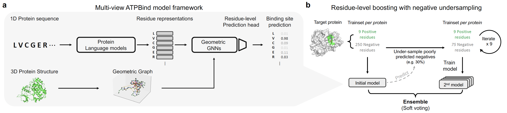

# Multi-view ATPBind & ResiBoost
The official code implementation for Multi-view ATPBind model and ResiBoost algorithm from our paper, "Residue-Level Multi-View Deep Learning for Accurate ATP Binding Site Prediction and Its Applications in Kinase Drug Binding".

Here, we provide codes for training Multi-view ATPBind model with ResiBoost on ATPBind dataset.

## Model description

The full model architecture and learning algorithm is shown below.


**Multi-view ATPBind**: The Multi-view model inputs both protein sequence and the corresponding 3D structure processed from pdb.

**ResiBoost**: The residue-level boosting algorithm performs boosting by undersampling poorly-predicted negative residues.

## Model Training

You can train Multi-view ATPBind on ATPBind dataset from scratch using the command below.
```
$ python atpbind_main.py --model_keys esm-33-gearnet-resiboost-v2 --valid_folds 0
```
The resulting performances are written in the result file [`result_cv/result_cv.csv`](result_cv/result_cv.csv).

We also support training on 5 validation folds and different versions of models listed blow.
To train on multiple validation sets or multiple versions, input the desired settings with separated with `+`;
```
$ python atpbind_main.py --model_keys esm-33+esm-33-gearnet-resiboost-v2 --valid_folds 0+1+2+3+4
```

### Supported training models

`esm-t33` : ESM2 model (t33 version: 33layers, 650M params)
`bert` : ProtBERT model
`gearnet`: GearNet model
`bert-gearnet`: ProtBert+GearNet Multi-view model
`esm-33-gearnet`: ESM2+GearNet Multi-view model
`esm-t33-ensemble`: ESM2 + Mean Ensemble
`esm-t33-resiboost`: ESM2 + ResiBoost
`bert-gearnet-ensemble`: ProtBert+GearNet Multi-view model + Mean Ensemble
`esm-33-gearnet-ensemble`: ESM2+GearNet Multi-view model + Mean Ensemble
`esm-33-gearnet-ensemble-rus`: ESM2+GearNet Multi-view model + Random Undersampling
`esm-33-gearnet-resiboost`: ESM2+GearNet Multi-view model + ResiBoost
`esm-33-gearnet-resiboost-v1n`
`esm-33-gearnet-resiboost-v2`
`esm-33-gearnet-resiboost-n25`
`esm-33-gearnet-resiboost-ri`: ESM2+GearNet Multi-view model + ResiBoost (random initialization)


## System Requirements
### Hardware requirements
Multi-view ATPBind was trained using a server with 40 Intel(R) Xeon(R) Silver 4210R @ 2.40GHz CPUs, 128GB RAM and GeForce RTX 3090 GPUs.
GPU memory usage was ~20GB.

### Software requirements

**Prerequisites**

Multi-view ATPBind training and evaluation were tested for the following python packages and versions.

  - `pytorch`
  - `torchdrug`
  - `numpy`
  - `pandas`
